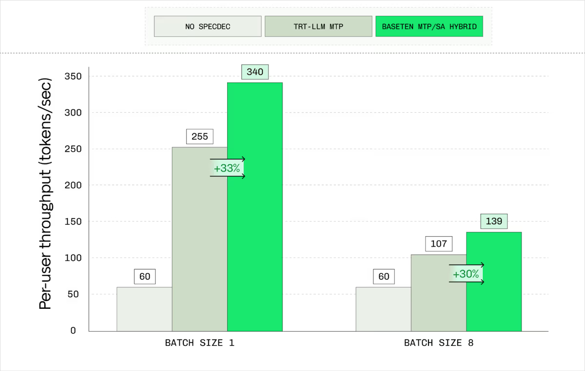
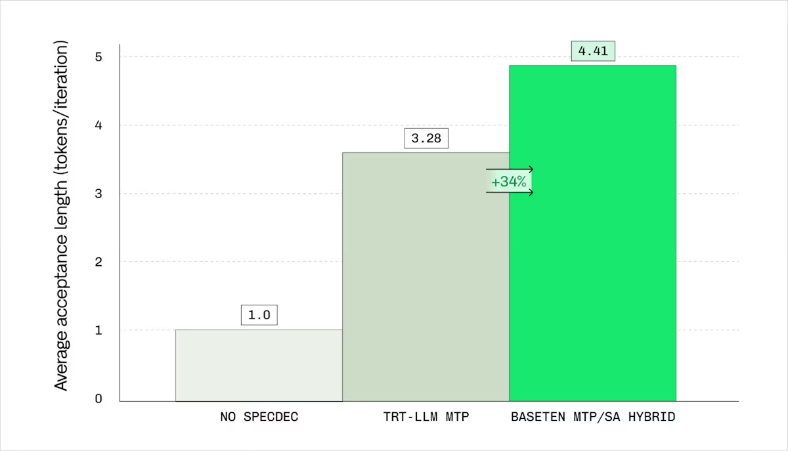
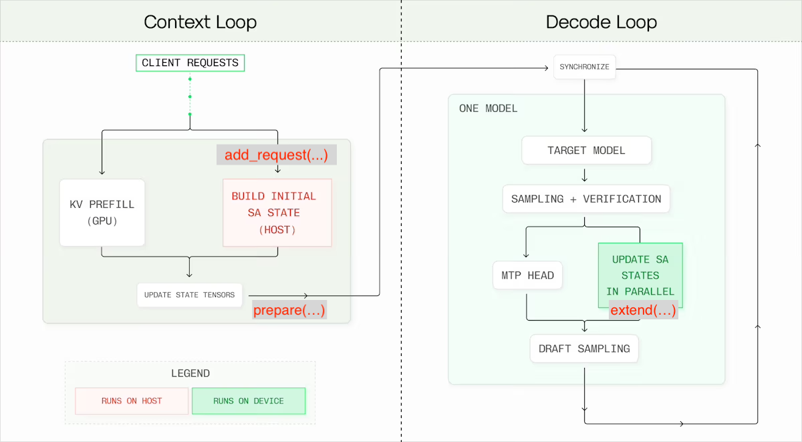

# **S**uffix **A**utomaton **Spec**ulative Decoding

Update: this project is now [merged in TensorRT-LLM](https://github.com/NVIDIA/TensorRT-LLM/pull/11434).

Per-user TPS            |  Accept Length
:-------------------------:|:-------------------------:
 | 

_As tested on [DeepSeek-V3.1-NVFP4](https://huggingface.co/nvidia/DeepSeek-V3.1-NVFP4) on the code-editing dataset [glaiveai/code_edits_sample](https://huggingface.co/datasets/glaiveai/code_edits_sample). See the [bench](./bench/) for repro._

SA_SPEC is an extension for TensorRT-LLM's Multi-Token Prediction (MTP) that boosts speculative decoding acceptance through a suffix-automaton-based n-gram lookup. The system dynamically chooses the best draft tokens: if a suffix match exceeds a specific threshold (SA_SPEC_THRESH, default 4), it uses n-gram drafts; otherwise, it defaults to standard MTP tokens.

To keep performance high, the suffix automaton is updated directly in CUDA during decoding, which eliminates host round-trips and stays compatible with the TensorRT-LLM overlap scheduler. By sharing the core algorithm and POD data layouts between the host and device, we’ve enabled zero-conversion transfers with identical semantics across both. To verify the zero-overhead design, we tested the system with the threshold set to infinity and confirmed that performance remains on par with vanilla MTP.


## Usage

Find the reference integration with TensorRT-LLM at https://github.com/NVIDIA/TensorRT-LLM/pull/10951.

-----

As described in [the blog post](https://www.baseten.co/blog/boosting-mtp-acceptance-rates-in-baseten-speculation-engine/), the API consists of 3 functions:
- `sa_spec.add_request(request_id: int, context: list[int])` is called on incoming requests. It builds the suffix automaton state using the context tokens and store the state it in host memory.
- `sa_spec.prepare(request_ids: list[int])` is called on generation requests before every iteration. It allocates batch indices for the new generation requests and copies their states from the host to the device. Additionally, it copies mapping of _\{external batch index -> suffix automaton batch index\}_ for the active generation requests, which is useful in case TRT-LLM shuffles the requests.
- `sa_spec.extend(...)` a CUDA-graph-compatible operation that updates the states of generation requests in the decode lookup. Explanation of its parameters: 
  - `match_len_out: tensor`, shape=\(batch_size\) output vector for the suffix match length
  - `draft_out: tensor`, shape=\(batch_size, draft_length\) output tensor for the suffix automaton lookup's next draft tokens
  - `accepted_in: tensor`, shape=\(batch_size, draft_length+1\) input tensor representing the newly accepted tokens (padded),
  - `accepted_lens_in: tensor` shape=\(batch_size\) input vector representing the number of accepted tokens.



Some points to help understand the flow:
- the device-side suffix automaton states are stored in a pre-allocated global buffer with a pre-defined constants for the maximum batch size and maximum sequence length. Check out the constants in [config.hpp](./src/sa_spec/util/config.hpp) _todo: make the shapes dynamic and use PyTorch tensors for the buffers._
- on `prepare()`, newly-prepared suffix automaton states are copied to the device in chunks using `cudaMemcpyAsync` on the active torch stream. The chunking is made using the visitor pattern. Check out [api.cc](src/api.cc) for the batch management and copy logic.
- `extend` launches a kernel with grid launch params ```<<<batch_size, 1>>>```. Check out [api.cu](./src/api.cu) for the kernel launch.
- Find the platform-agnostic implementation of the Suffix Automaton in [suffix_automaton.hpp](./src/sa_spec/suffix_automaton.hpp).

## Test
Python tests:
```bash
pytest
```
C++ tests:
```bash
mkdir build && cd build
cmake .. && make -j
./build/test_runner
```
